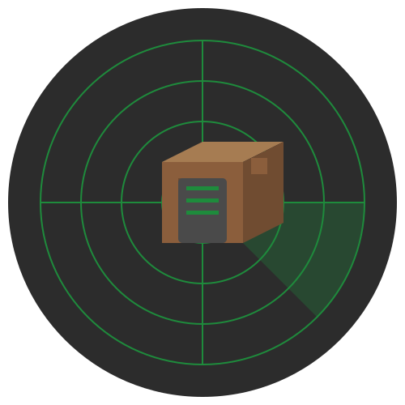

# MCServerRadar

A powerful Minecraft server scanner, monitor, and visualization tool.

<div align="center">
    
    <p>
        <a href="README.md">中文</a> | English
    </p>
    <p>
        
        
        
        
    </p>
    <p>
        🌍 Live Demo: <a href="https://mc-scan.pages.dev" target="_blank">https://mc-scan.pages.dev</a> (Coming Soon)
    </p>
</div>

## 📖 Introduction

MCServerRadar is a specialized scanning and monitoring tool designed for Minecraft servers. It can:

- Automatically discover and scan Minecraft servers worldwide
- Monitor server status and player count in real-time
- Provide a beautiful web interface to display server information
- Support filtering servers by country/region
- Visualize server geographical distribution

## ✨ Features

- 🔍 Global Minecraft server scanning
- 🌍 GeoIP-based server location identification
- 📊 Beautiful web interface
- 📈 Real-time server status monitoring
- 🗺 Country/region-based categorization
- 📱 Responsive design for mobile access
- 🚀 High-performance async scanning
- 🔒 Privacy-focused (excludes private IP ranges)
- 📝 Detailed server information
- 🌐 Multi-language support

## 🌟 Live Demo

Visit our demo site: [https://mc-scan.pages.dev](https://mc-scan.pages.dev) (Coming Soon)

On the demo site, you can:
- View global Minecraft server distribution
- Monitor server status in real-time
- Filter servers by country/region
- Experience all core features

## 🚀 Quick Start

### Prerequisites

- Python 3.8+
- GeoLite2 Country Database
- Internet connection

### Installation

1. Clone the repository:
```bash
git clone https://github.com/MoTeam-org/MCServerRadar.git
cd MCServerRadar
```

2. Install dependencies:
```bash
pip install -r requirements.txt
```

3. Download GeoLite2 database:
- Get `GeoLite2-Country.mmdb` from [MaxMind](https://dev.maxmind.com/geoip/geolite2-free-geolocation-data)
- Place it in the project root directory

### Usage

1. Scan servers:
```bash
# Scan servers in a specific country
python scan.py --country china

# Random global scan
python scan.py --mode random

# Scan specific IP range
python scan.py --mode range --start-ip 1.1.1.1 --end-ip 1.1.1.255
```

2. Start web interface:
```bash
python web.py
```

3. Access the dashboard:
- Open your browser and visit `http://localhost:5000`

## 📊 Features Detail

### Scanning Modes

- **Country-specific**: Scan servers in specific countries
- **Random Global**: Randomly sample IPs worldwide
- **IP Range**: Scan a specific IP range
- **Single Host**: Scan all ports of a single host
- **Multiple Servers**: Scan a list of known servers
- **Full IPv4**: Scan the entire IPv4 space (use with caution)

### Server Information

- Server version
- Online/max players
- MOTD (Message of the Day)
- Latency
- Player sample (if available)
- Geographic location
- Last update time

### Web Interface

- Real-time statistics
- Country-based grouping
- Server status indicators
- Responsive design
- Search and filter capabilities
- Interactive maps (coming soon)

## 🛠 Technical Stack

- **Backend**
  - Python 3.x
  - Flask (Web framework)
  - MCStatus (Server query)
  - GeoIP2 (Location detection)
  - Async IO (High-performance scanning)

- **Frontend**
  - Bootstrap 5
  - Flag Icons
  - Custom CSS animations
  - Responsive design

## 💡 Best Practices

### Scanning Tips

1. **Responsible Usage**
   - Start with small-scale test scans
   - Avoid frequent scanning of the same IP range
   - Respect target server policies

2. **Performance Optimization**
   - Adjust batch size appropriately
   - Tune timeout settings based on network conditions
   - Use country-specific scanning for better efficiency

3. **Data Management**
   - Clean up expired data regularly
   - Backup important scan results
   - Set appropriate save intervals

### Deployment Guidelines

1. **System Requirements**
   - Recommended: Linux system
   - Ensure sufficient network bandwidth
   - SSD storage recommended

2. **Network Configuration**
   - Configure appropriate firewall rules
   - Use proxy servers to distribute requests
   - Avoid triggering IP bans

3. **Monitoring & Maintenance**
   - Set up logging
   - Monitor system resource usage
   - Check for updates regularly

## 🤝 Contributing

We welcome contributions! Here's how you can help:

1. Fork the repository
2. Create your feature branch (`git checkout -b feature/AmazingFeature`)
3. Commit your changes (`git commit -m 'Add some AmazingFeature'`)
4. Push to the branch (`git push origin feature/AmazingFeature`)
5. Open a Pull Request

## 📝 License

This project is licensed under the Apache License 2.0 - see the [LICENSE](LICENSE) file for details.

## 🙏 Acknowledgments

- [MCStatus](https://github.com/Dinnerbone/mcstatus) for the Minecraft server query library
- [MaxMind](https://www.maxmind.com) for the GeoIP2 database
- [Bootstrap](https://getbootstrap.com) for the frontend framework
- All contributors who have helped this project grow

## 📞 Contact

- GitHub Issues: [Create an issue](https://github.com/MoTeam-org/MCServerRadar/issues)
- Email: [moteam.org@gmail.com]

## 🔮 Roadmap

- [ ] Add server history tracking
- [ ] Implement real-time updates
- [ ] Add interactive world map
- [ ] Support for Bedrock servers
- [ ] Add more scanning modes
- [ ] Improve scanning performance
- [ ] Add API documentation
- [ ] Add Docker support

## ❓ FAQ

1. **Why is scanning slow?**
   - Check network connectivity
   - Adjust concurrent connection limits
   - Consider using proxy servers

2. **How to improve scan accuracy?**
   - Increase timeout values appropriately
   - Validate results with multiple scans
   - Use reliable IP data sources

3. **How to handle scanning errors?**
   - Check detailed error logs
   - Verify network connection
   - Validate target server status

## 📚 Related Resources

- [Minecraft Official Website](https://www.minecraft.net/)
- [MCStatus Documentation](https://github.com/Dinnerbone/mcstatus)
- [GeoIP2 Documentation](https://dev.maxmind.com/geoip) 